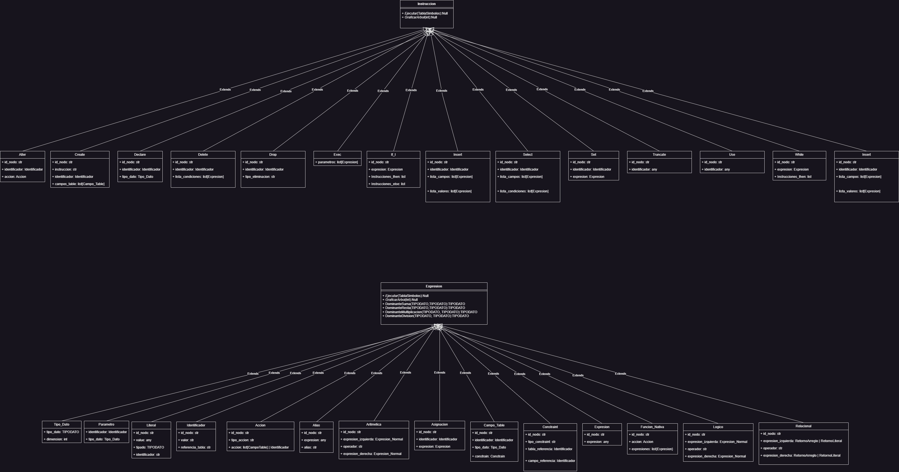

# Manual Técnico OLC2

Creado por: CARLOS JAVIER MARTÍNEZ POLANCO
Fecha de creación: 20 de diciembre de 2023 20:49

# Herramientas de desarrollo

1. Desarrollo de la lógica del sistema: Python 3.12.0 
2. Desarrollo de la interfaz gráfica: Tkinter
3. Generador de lenguaje: PLY 3.11
4. Manejo de archivos XML: xmltodict 0.13.0
5. Gráficas y tablas: Graphviz

## Especificaciones del sistema

Se solicita que el estudiante desarrolle un sistema administrador de base de datos. Este sistema deberá ser capaz de manejar las instrucciones básicas de un Sistema de Gestión de Base de Datos (DBMS) relacional convencional. El sistema, que recibirá el nombre de XSQL, se propone como una solución integral para la gestión de bases de datos.

El servidor de base de datos debe contar con un Entorno de Desarrollo Integrado (IDE) con el que el usuario pueda interactuar directamente. Este IDE será la interfaz principal del usuario con el sistema XSQL y deberá ser diseñado con un enfoque en la facilidad de uso. Además, el servidor deberá contar con un conjunto de herramientas básicas que permitan un uso sencillo y eficiente de la herramienta, proporcionando una experiencia de usuario fluida y eficaz.

Para el almacenamiento y manipulación de la información de las bases de datos, el estudiante deberá manejar un sistema de archivos con formato XML. Este sistema de archivos contendrá la estructura de las bases de datos creadas, así como cualquier tabla, objeto o procedimiento que estas puedan contener. Este formato facilitará la organización, acceso y manipulación de los datos almacenados.

Finalmente, para la manipulación de la información, el estudiante deberá implementar un intérprete XML. Este intérprete será responsable de leer la información almacenada en los archivos XML. La forma específica en que se implemente este intérprete queda a discreción del estudiante, pero deberá ser capaz de leer eficientemente la información contenida en los archivos.

## Lenguaje XSQL

El lenguaje XSQL es un lenguaje de bases de datos. Este lenguaje se divide en 4 partes: DML, DDL, DCL y SSL

1. DDL (Data Definition Language por sus siglas en inglés): conjunto de
instrucciones de definición de datos. Este set de instrucciones se encarga de definir la estructura de las bases de datos, tablas, procedimientos y objetos.
2. DML (Data Manipulation Language por sus siglas en inglés): conjunto de instrucciones que manipulan los datos. Este set de instrucciones se encarga de manipular la información siguiendo la estructura definida por las instrucciones DDL.
3. SSL (System Statement Language por sus siglas en inglés): conjunto de sentencias propias del sistema XSQL, permite la escritura de sentencias de control y funciones propias utilizadas en el manejo de la información.

### Tokens válidos

```
# Expresiones aritméticas                                                                                                                                                                                                                                                                                                                                                                                                                                                                                                                                                                                                                                                                                                                                                                                                                                                                                                                                                                                                                                                                                                                                                                                                                                                                                                                                                                                                                                                                                                                                                                                                                                                                                                                                                                                                                                                                                                                                                                                                                                                                                                                                                                                                                                                                                                                                                                                                                                                                                                                                                                                                                                                                                                                                                                                                                                                                                                                                                                                                                                                                                                                                                                                                         
MAS,
MENOS,
POR,
DIVIDIDO,

# Expresiones relacionales
IGUALIGUAL,
DIFERENTE,
MENORIGUAL,
MAYORIGUAL,
MAYOR,
MENOR,

# Expresiones logicas
OR_OP,
AND_OP,
NOT_OP,
IZQPAREN,
DERPAREN,

# Literal
LNUMERO,
LDECIMAL,
LFECHA,
LFECHAHORA,
LVARCHAR,

# Otros
ID,
COMA,
PUNTO,
ARROBA,
IGUAL,
PUNTOYCOMA

# Reservadas

# Sentencias DDL
CREATE,
ALTER,
DROP,
DECLARE,
SET,
INTO,
BETWEEN,
TRUNCATE,
AS,
VALUES,
RETURN,
BEGIN,
END,
ADD,
EXEC,
AND,
USE,
IF,
ELSE,
WHILE,
THEN,

# Tipos de objeto
DATABASE,
TABLE,
COLUMN,
PROCEDURE,
FUNCTION,

# Tipos de dato
INT,
BIT,
DECIMAL,
DATETIME',
DATE,
NCHAR,
NVARCHAR,

# Constraint
PRIMARY,
NOT,
NULL,
KEY,
REFERENCES,

# Sentencia DML
SELECT,
INSERT,
UPDATE,
DELETE,
FROM,
WHERE,

# Funciones nativas
CONCATENA,
SUBSTRAER,
HOY,
CONTAR,
SUMA,
CAST,
```

### Precedencia de operadores

precedence = (
('left', 'OR_OP'),
('left', 'AND_OP'),
('left', 'IGUALIGUAL', 'DIFERENTE', 'MENOR', 'MAYOR', 'MENORIGUAL', 'MAYORIGUAL'),
('left', 'MAS', 'MENOS'),
('left', 'POR', 'DIVIDIDO'),
('right', 'NOT_OP'),
('left', 'IZQPAREN', 'DERPAREN'),
)

### Gramática XSQL

### INICIO

Esta es la instrucción inicial del parser o mejor conocido como nodo raíz.

inicio : instrucciones

### INSTRUCCIONES

Esta es una lista de instrucciones, la cual almacenara nuestro AST de objetos.
instrucciones : instrucciones instruccion
instrucciones | instruccion

### INSTRUCCION

Esta producción facilita identificar el tipo de instrucción o sentencia de control de flujo esta utilizando el programa.

instruccion : declare
| set
| if
| while
| comando_sql
| RETURN expresion PUNTOYCOMA

### COMANDO_SQL

Esta producción facilita identificar el tipo de comando utilizado, especialmente para las sentencias DDL, DML Y SSL.

comando_sql : sentencia_ddl
| sentencia_dml
| exec
| use

### SET

Esta producción reconoce el uso del SET como asignación de datos a una variable.

set : SET identificador IGUAL expresion PUNTOYCOMA

### USE

Esta producción nos ayuda a identificar en que base de datos del sistema se almacenaran las estructuras o la data.

use : USE LVARCHAR PUNTOYCOMA

### Declare

Esta producción permite la declaración de una variable. Su principal función es almacenar en la tabla de símbolos las variables que se declaran. 

declare : DECLARE identificador tipo_dato PUNTOYCOMA
| DECLARE identificador AS tipo_dato PUNTOYCOMA

### TIPO_DATO

Esta producción nos ayuda a identificar qué tipo de dato tiene una variable o parámetro. Están divididos en 3 grupos los tipos de datos, un segmento numérico (BIT, ENTEROS Y DECIMALES), un segmento para fechas (FECHA Y HORA O SOLO LA FECHA) y uno para cadenas (NCHAR, NVARCHAR) las cuales tiene un límite superior e inferior para ser válidas.

tipo_dato : seg_num
| seg_date
| seg_string

seg_num : INT
| DECIMAL
| BIT

seg_date : DATE
| DATETIME

seg_string : NVARCHAR IZQPAREN LNUMERO DERPAREN
| NCHAR IZQPAREN LNUMERO DERPAREN

### SENTENCIA_DDL

Esta producción nos permite separar los tipos de sentencias, en este caso el DDL esta compuesto por el CREATE, ALTER, TRUNCATE Y DROP.

sentencia_ddl : create
| alter
| truncate
| drop

### CREATE

Esta producción nos permite ejecutar los CREATE, para la creación de los diferentes objetos SQL como lo son: Bases de datos, Tablas, Procedimientos y Funciones.

create : CREATE DATABASE identificador PUNTOYCOMA
| CREATE TABLE identificador IZQPAREN campos_table DERPAREN PUNTOYCOMA
| CREATE PROCEDURE identificador IZQPAREN parametros DERPAREN AS BEGIN instrucciones END PUNTOYCOMA
| CREATE FUNCTION identificador IZQPAREN parametros DERPAREN RETURN tipo_dato AS BEGIN instrucciones END PUNTOYCOMA

### CAMPOS_TABLE

Esta producción nos permite crear una lista con los campos que contiene una tabla.

campos_table : campos_table COMA identificador tipo_dato constraint
| campos_table COMA identificador tipo_dato
| identificador tipo_dato constraint
| identificador tipo_dato

### PARAMETROS

Esta producción nos permite crear una lista de parámetros que pueden ser parte de una función o un procedimiento.  

parametros : parametros COMA identificador AS tipo_dato
| identificador AS tipo_dato
| parametros COMA identificador tipo_dato
| identificador tipo_dato

### CONSTRAINT

Esta producción nos permite marcar las restricciones de campo que puede tener un campo de una tabla. 

constraint : PRIMARY KEY
| NOT NULL
| REFERENCES identificador IZQPAREN identificador DERPAREN

### ALTER

Esta producción nos permite modificar la estructura de una tabla, agregándole o quitándole campos dependiendo de la acción que se desea realizar utilizando las instrucciones ADD COLUMN o DROP COLUMN. 

alter : ALTER TABLE identificador accion PUNTOYCOMA

accion : ADD COLUMN campos_table
| DROP COLUMN identificador

### DROP

Esta producción nos permite ejecutar la eliminación de un objeto SQL como las Bases de datos, Tablas, Procedimientos y Funciones.

drop : DROP DATABASE identificador PUNTOYCOMA
| DROP TABLE identificador PUNTOYCOMA
| DROP PROCEDURE identificador PUNTOYCOMA
| DROP FUNCTION identificador PUNTOYCOMA

### TRUNCATE

Con esta producción podemos eliminar todos los datos de una tabla, realiza una operación de limpieza de la tabla.

truncate : TRUNCATE TABLE identificador PUNTOYCOMA

### EXEC

Esta producción ejecuta el EXEC, quien se encarga de la ejecución de los procedimientos almacenados en una base de datos. 

exec : EXEC identificador lista_expresiones PUNTOYCOMA

### SENTENCIA_DML

Esta producción nos permite separar los tipos de sentencias, en este caso el DML esta compuesto por el SELECT, INSERT, UPDATE Y DELETE

sentencia_dml : select
| insert
| update
| delete

### SELECT

Esta producción nos permite ejecutar todas las acciones semánticas de un SELECT, que sirve para realizar consultas a una tabla, llamar a una función o imprimir valores en pantalla.

select : SELECT POR FROM identificador PUNTOYCOMA
| SELECT IZQPAREN lista_expresiones DERPAREN FROM identificador PUNTOYCOMA
| SELECT lista_expresiones FROM identificador PUNTOYCOMA
| SELECT POR FROM identificador WHERE condicion PUNTOYCOMA
| SELECT IZQPAREN lista_expresiones DERPAREN FROM identificador WHERE condicion PUNTOYCOMA
| SELECT lista_expresiones FROM identificador WHERE condicion PUNTOYCOMA
| SELECT lista_expresiones PUNTOYCOMA

### INSERT

Esta producción nos permite insertar valores en los campos de una tabla para crear un registro. Es permitido el filtrado de los campos y condicionar la operación.

insert : INSERT INTO identificador IZQPAREN lista_expresiones DERPAREN VALUES IZQPAREN lista_expresiones DERPAREN PUNTOYCOMA

### UPDATE

Con esta producción podemos actualizar un registro de una tabla, es permitido el filtrado de los campos y condicionar la operación.

update : UPDATE identificador SET lista_expresiones WHERE condicion PUNTOYCOMA

### DELETE

Esta producción nos permite eliminar datos de un registro en una tabla, también es permitido el filtrado de los campos y condicionar la operación.

delete : DELETE FROM identificador WHERE condicion PUNTOYCOMA
| DELETE FROM identificador PUNTOYCOMA

### IF

Esta producción reconoce todas las instrucciones condiciones de un IF, también toma en cuenta la ejecución de las instrucciones del ELSE, en caso este se haga presente en la entrada.

if : IF expresion THEN instrucciones ELSE instrucciones END IF PUNTOYCOMA
| IF expresion THEN instrucciones END IF PUNTOYCOMA
| IF expresion BEGIN instrucciones END ELSE BEGIN instrucciones END
| IF expresion BEGIN instrucciones END

### WHILE

Esta instrucción nos permite la ejecución de un bucle condicional.

while : WHILE expresion BEGIN instrucciones END

### CONDICION

Esta producción nos da acceso a las condiciones que se presentan en el filtrado de las tablas.

condicion : condicion AND expresion
| expresion

### LISTA_EXPRESIONES

Esta producción reconoce listas de expresiones que al ejecutarlas nos retornan un valor. 

lista_expresiones : lista_expresiones COMA expresion
| expresion

### EXPRESION

Con esta producción podemos identificar el tipo de expresión que se retorna.

expresion : aritmeticos
| relacionales
| logicos
| literal
| funcion_nativa
| IZQPAREN expresion DERPAREN
| asignacion
| identificador
| alias
| IF IZQPAREN lista_expresiones DERPAREN

### ALIAS

Con esta producción podemos definir un alias para las tablas o las expresiones que deseamos utilizar para filtrar una tabla o nombrar cualquier operación realizada en las expresiones. 

alias : expresion AS ID
| expresion ID

### ASIGNACION

La producción nos permite asignar el valor de una expresión a un identificador.

asignacion : identificador IGUAL expresion

### FUNCION_NATIVA

Con esta producción podemos ejecutar las funciones nativas del sistema.

funcion_nativa : CONCATENA IZQPAREN lista_expresiones DERPAREN
| SUBSTRAER IZQPAREN lista_expresiones DERPAREN
| HOY IZQPAREN DERPAREN
| CONTAR IZQPAREN POR DERPAREN
| SUMA IZQPAREN expresion DERPAREN
| CAST IZQPAREN expresion AS tipo_dato DERPAREN

### ARITMETICOS

Ejecutamos todas las operaciones Aritméticas disponibles en el sistema.

aritmeticos : expresion MAS expresion
| expresion MENOS expresion
| expresion POR expresion
| expresion DIVIDIDO expresion

### RELACIONALES

Ejecutamos todas las operaciones Relacionales disponibles en el sistema.

relacionales : expresion IGUALIGUAL expresion
| expresion DIFERENTE expresion
| expresion MENOR expresion
| expresion MAYOR expresion
| expresion MENORIGUAL expresion
| expresion MAYORIGUAL expresion
| BETWEEN expresion AND expresion

### LOGICOS

Ejecutamos todas las operaciones Lógicas disponibles en el sistema.

logicos : expresion AND_OP expresion
| expresion OR_OP expresion
| NOT_OP expresion

### LITERAL

Esta producción nos permite retornar un valor generado por cualquier operación en una expresión o simplemente retornar un valor especificado.

literal : LNUMERO

literal : LDECIMAL

literal : LFECHA

literal : LFECHAHORA

literal : LVARCHAR

### IDENTIFICADOR

Esta producción hace referencia a los identificadores y alias de las tablas manejados por el sistema.

identificador : ID
| ID PUNTO ID
| ARROBA ID

## Diagrama de clases



## Archivos de entrada

### V1

```
CREATE DATA BASE tbbanco;
USE tbbanco;
CREATE TABLE tbestado (
idestado int PRIMARY KEY,
estado nvarchar(50) NOT NULL);

CREATE TABLE tbidentificaciontipo (tado
ididentificaciontipo int PRIMARY KEY,
identificaciontipo nvarchar(15) not null);

CREATE TABLE tbcliente (codigocliente nvarchar(15) PRIMARY KEY,
primer_nombre nvarchar(50) not null,
segundo_nombre nvarchar(50),
primer_apellido nvarchar(50) not null,
segundo_apellido nvarchar(50),
fecha_nacimiento date not null,
genero nvarchar(1),
idestado int not null REFERENCE tbestado (idestado));

CREATE TABLE tbidentificacion (
ididentificacion int PRIMARY KEY,
codigocliente nvarchar(15) PRIMARY KEY REFERENCE tbcliente (codigocliente),
identificacion nvarchar(20) NOT NULL,
ididentificaciontipo int REFERENCE tbidentificaciontipo (ididentificaciontipo));

INSERT INTO tbidentificaciontipo (ididentificaciontipo,identificaciontipo) VALUES(1,'DPI');
INSERT INTO tbidentificaciontipo (ididentificaciontipo,identificaciontipo) VALUES(2,'NIT');
INSERT INTO tbidentificaciontipo (ididentificaciontipo,identificaciontipo) VALUES(3,'PASAPORTE');

INSERT INTO tbestado (idestado,estado) VALUES(1,'Activo');
INSERT INTO tbestado (idestado,estado) VALUES(2,'Inactivo');
INSERT INTO tbestado (idestado,estado) VALUES(3,'Eliminado');

INSERT INTO tbcliente (codigocliente,primer_nombre,segundo_nombre,primer_apellido,segundo_apellido,fecha_nacimiento,genero,idestado)
VALUES ('GT-0001','PETER','JUAN','PARKER','SEGUNDO','1990-01-01','M',1);
INSERT INTO tbcliente (codigocliente,primer_nombre,primer_apellido,segundo_apellido,fecha_nacimiento,idestado)
VALUES ('GT-0002','JULIO','PEREZ','LOPEZ','1995-12-01',1);
INSERT INTO tbidentificacion (ididentificacion,codigocliente,identificacion,ididentificaciontipo)
VALUES (1,'GT-0001','45784560101',1);
INSERT INTO tbidentificacion (ididentificacion,codigocliente,identificacion,ididentificaciontipo)
VALUES (2,'GT-0001','94675057',2);
INSERT INTO tbidentificacion (ididentificacion,codigocliente,identificacion,ididentificaciontipo)
VALUES (3,'GT-0002','4854560101',1);

CREATE TABLE tbproducto (idproducto int primary key,
producto nvarchar(100) not null,
idestado int not null);

INSERT INTO tbproducto (idproducto,producto,idestado) VALUES(1,'Credito Fiduiciario',1);
INSERT INTO tbproducto (idproducto,producto,idestado) VALUES(2,'Credito Hipotecario',1);
INSERT INTO tbproducto (idproducto,producto,idestado) VALUES(3,'Tarjeta de Credito Oro',1);

ALTER TABLE tbproducto ADD COLUMN tasa decimal;

CREATE TABLE tbcredito (credito int PRIMARY KEY,nocuenta nvarchar(20) not null,
idcliente int not null,fechaultimocorte date not null,idproducto int REFERENCE tbproducto (idproducto));

CREATE TABLE tbobligaciontipo (idobligaciontipo int PRIMARY KEY,obligaciontipo nvarchar(30));

INSERT INTO tbobligaciontipo (identificaciontipo,obligaciontipo) VALUES (1,'DIRECTO');
INSERT INTO tbobligaciontipo (identificaciontipo,obligaciontipo) VALUES (2,'INDIRECTO');

CREATE TABLE tbcreditoobligacion (codigocliente nvarchar(15) PRIMARY KEY, credito int PRIMARY KEY,
idobligaciontipo int REFERENCE tbobligaciontipo (idobligaciontipo));

INSERT INTO tbcredito (credito,nocuenta,idcliente,fechaultimocorte,idproducto) VALUES (1,'45-5454',1,'2023-11-30',1);
INSERT INTO tbcredito (credito,nocuenta,idcliente,fechaultimocorte,idproducto) VALUES (2,'AF4545D',3,'2023-11-30',1);
INSERT INTO tbcreditoobligacion (codigocliente,Credito,idobligaciontipo) VALUES ('GT-0001',1,1);
INSERT INTO tbcreditoobligacion  (codigocliente,Credito,idobligaciontipo) VALUES('GT-0002',2,1);

CREATE TABLE tbcreditoSaldo (credito int PRIMARY KEY, fechacorte date PRIMARY KEY, idmoneda int PRIMARY KEY,
idcreditoestado int PRIMARY KEY, SaldoActual decimal, SaldoMora decimal,ValorCuota decimal,DiasMora int,
alturamora int not null,limite decimal not null,idcalificacion int not null);

insert into tbcreditoSaldo (credito,fechacorte,idmoneda,idcreditoestado,SaldoActual,SaldoMora,ValorCuota,DiasMora,
alturamora,limite,idcalificacion) values (1,'2023-01-31',1,1,05,0,600,0,0,5000,1);
insert into tbcreditoSaldo (credito,fechacorte,idmoneda,idcreditoestado,SaldoActual,SaldoMora,ValorCuota,DiasMora,
alturamora,limite,idcalificacion) values (1,'2023-02-28',1,1,4400,0,600,0,0,5000,1);
insert into tbcreditoSaldo (credito,fechacorte,idmoneda,idcreditoestado,SaldoActual,SaldoMora,ValorCuota,DiasMora,
alturamora,limite,idcalificacion) values (1,'2023-03-31',1,1,3800,0,600,0,0,5000,1);
insert into tbcreditoSaldo (credito,fechacorte,idmoneda,idcreditoestado,SaldoActual,SaldoMora,ValorCuota,DiasMora,
alturamora,limite,idcalificacion) values (1,'2023-04-30',1,1,3200,0,600,0,0,5000,1);
insert into tbcreditoSaldo (credito,fechacorte,idmoneda,idcreditoestado,SaldoActual,SaldoMora,ValorCuota,DiasMora,
alturamora,limite,idcalificacion) values (1,'2023-05-31',1,1,2600,0,600,0,0,5000,1);
insert into tbcreditoSaldo (credito,fechacorte,idmoneda,idcreditoestado,SaldoActual,SaldoMora,ValorCuota,DiasMora,
alturamora,limite,idcalificacion) values (1,'2023-06-30',1,1,2600,600,600,30,1,5000,1);
insert into tbcreditoSaldo (credito,fechacorte,idmoneda,idcreditoestado,SaldoActual,SaldoMora,ValorCuota,DiasMora,
alturamora,limite,idcalificacion) values (1,'2023-07-31',1,1,3150,1200.25,600,60,2,5000,1);
insert into tbcreditoSaldo (credito,fechacorte,idmoneda,idcreditoestado,SaldoActual,SaldoMora,ValorCuota,DiasMora,
alturamora,limite,idcalificacion) values (1,'2023-08-30',1,1,3760,1700,600,90,3,5000,1);
insert into tbcreditoSaldo (credito,fechacorte,idmoneda,idcreditoestado,SaldoActual,SaldoMora,ValorCuota,DiasMora,
alturamora,limite,idcalificacion) values (1,'2023-09-30',1,2,4275,2300,600,120,4,5000,1);
insert into tbcreditoSaldo (credito,fechacorte,idmoneda,idcreditoestado,SaldoActual,SaldoMora,ValorCuota,DiasMora,
alturamora,limite,idcalificacion) values (1,'2023-10-31',1,2,4275,2900,600,120,4,5000,1);
insert into tbcreditoSaldo (credito,fechacorte,idmoneda,idcreditoestado,SaldoActual,SaldoMora,ValorCuota,DiasMora,
alturamora,limite,idcalificacion) values (1,'2023-11-30',1,2,4275,3500,700,120,4,5000,1);
insert into tbcreditoSaldo (credito,fechacorte,idmoneda,idcreditoestado,SaldoActual,SaldoMora,ValorCuota,DiasMora,
alturamora,limite,idcalificacion) values (1,'2023-12-31',1,2,3575,3575,600,120,4,5000,1);

insert into tbcreditoSaldo (credito,fechacorte,idmoneda,idcreditoestado,SaldoActual,SaldoMora,ValorCuota,DiasMora,
alturamora,limite,idcalificacion) values (2,'2023-01-31',1,1,15000,0,1250.25,0,0,15000,1);
insert into tbcreditoSaldo (credito,fechacorte,idmoneda,idcreditoestado,SaldoActual,SaldoMora,ValorCuota,DiasMora,
alturamora,limite,idcalificacion) values (2,'2023-02-28',1,1,14249.75,0,1250.25,0,0,15000,1);
insert into tbcreditoSaldo (credito,fechacorte,idmoneda,idcreditoestado,SaldoActual,SaldoMora,ValorCuota,DiasMora,
alturamora,limite,idcalificacion) values (2,'2023-03-31',1,1,12999.50,0,1250.25,0,0,15000,1);
insert into tbcreditoSaldo (credito,fechacorte,idmoneda,idcreditoestado,SaldoActual,SaldoMora,ValorCuota,DiasMora,
alturamora,limite,idcalificacion) values (2,'2023-04-30',1,1,11748.75,0,1250.75,0,0,15000,1);
insert into tbcreditoSaldo (credito,fechacorte,idmoneda,idcreditoestado,SaldoActual,SaldoMora,ValorCuota,DiasMora,
alturamora,limite,idcalificacion) values (2,'2023-05-31',1,1,10498,0,1250.75,0,0,15000,1);
insert into tbcreditoSaldo (credito,fechacorte,idmoneda,idcreditoestado,SaldoActual,SaldoMora,ValorCuota,DiasMora,
alturamora,limite,idcalificacion) values (2,'2023-06-30',1,1,9247.25,0,1250.75,0,0,15000,1);
insert into tbcreditoSaldo (credito,fechacorte,idmoneda,idcreditoestado,SaldoActual,SaldoMora,ValorCuota,DiasMora,
alturamora,limite,idcalificacion) values (2,'2023-07-31',1,1,7996.50,0,1250.75,0,0,15000,1);
insert into tbcreditoSaldo (credito,fechacorte,idmoneda,idcreditoestado,SaldoActual,SaldoMora,ValorCuota,DiasMora,
alturamora,limite,idcalificacion) values (2,'2023-08-30',1,1,6745.75,0,1250.75,0,0,15000,1);
insert into tbcreditoSaldo (credito,fechacorte,idmoneda,idcreditoestado,SaldoActual,SaldoMora,ValorCuota,DiasMora,
alturamora,limite,idcalificacion) values (2,'2023-09-30',1,2,5495,0,1250.75,0,0,15000,1);
insert into tbcreditoSaldo (credito,fechacorte,idmoneda,idcreditoestado,SaldoActual,SaldoMora,ValorCuota,DiasMora,
alturamora,limite,idcalificacion) values (2,'2023-10-31',1,2,4244.25,0,1250.75,0,0,15000,1);
insert into tbcreditoSaldo (credito,fechacorte,idmoneda,idcreditoestado,SaldoActual,SaldoMora,ValorCuota,DiasMora,
alturamora,limite,idcalificacion) values (2,'2023-11-30',1,2,2993.50,0,1250.75,0,0,15000,1);
insert into tbcreditoSaldo (credito,fechacorte,idmoneda,idcreditoestado,SaldoActual,SaldoMora,ValorCuota,DiasMora,
alturamora,limite,idcalificacion) values (2,'2023-12-31',1,2,1742.75,0,1250.75,0,0,15000,1);

SELECT tbcliente.codigocliente,CONCATENA(tbcliente.primer_nombre,tbcliente.primer_apellido),
tbidentificacion.identificacion,tbidentificaciontipo.identificaciontipo
FROM tbcliente,tbidentificacion ,tbidentificaciontipo
where tbcliente.codigocliente = tbidentificacion.codigocliente
&& tbcliente.identificaciontipo = tbidentificacion.identificaciontipo;

SELECT tbcredito.credito,tbcredito.fechaultimocorte,tbcredito.nocuenta,fechaultimocorte,tbproducto.producto,
idmoneda,SaldoActual,SaldoMora,ValorCuota,DiasMora,alturamora,limite,idcalificacion
FROM tbcredito,tbcreditoobligacion,tbcreditoSaldo,tbcliente,tbproducto
where tbcredito.credito = tbcreditoobligacion.credito
&& tbcreditoobligacion.Credito = tbcreditoSaldo.credito
&& tbcliente.codigocliente = tbcreditoobligacion.codigocliente
&& tbproducto.idproducto = tbcredito.idproducto

select CONTAR(*) FROM tbcredito
SELECT SUMA(SaldoActual) from tbcreditoSaldo
SELECT HOY()

SELECT HOY(),SUBSTRAER(primer_nombre,1,5)
from tbcliente
```

## V2

```
-----lo del bit son puntos extras

CREATE FUNCTION fn_regresatasa (@idproducto int)
RETURN decimal
AS
BEGIN
	DECLARE @TASA as decimal;
	set @TASA = (select tasa from tbproducto where idproducto = @idproducto and idestado = 1);

	RETURN @TASA;

END

CREATE FUNCTION fn_retornanombre (@identificacion nvarchar(20),@primernombre,@segundonombre)
RETURN nvarchar(100)
AS
BEGIN

	DECLARE @nombres nvarchar(100);
	DECLARE @apellidos nvarchar(100);
	DECLARE @nombrecompleto nvarchar(100);

	set @nombres = CONCATENA (@primer_nombre,@segundo_nombre) ;
		set @APELLIDOS = CONCATENA (@primer_nombre,@segundo_nombre) ;
	set @nombrecompleto = CONCATENA(@nombrecompleto,@apellidos);

	return @nombrecompleto;

END

select fn_retornanombre(identificacion)
from tbidentificacion
where idestado = 1;

CREATE PROCEDURE sp_actualizatasa(@aumento int,@fecha date)
AS
BEGIN
		IF (@aumento > 0)
		BEGIN

			update tbproducto set tasa = tasa+(tasa*@aumento/100)
			where idestado = 1;
		END
		ELSE
		BEGIN
			update tbproducto set tasa = tasa+(tasa*(@aumento))
			where idestado = 1;
		END

		DECLARE @tasa nvarchar(5);
		SET @tasa = CAS(@aumento as nvarchar(5));
		INSERT INTO tbbitacoracambio (tabla,fecha,cambio)
		VALUES ('tbproducto',@fecha,CONCATENA('CAMBIO DE TASA, VALOR AUMENTA',@tasa));

END

SELECT * FROM tbproducto where idestado = 1;
exec sp_actualizatasa (10,'18-12-2023');
SELECT * FROM tbproducto where idestado = 1;
select * from tbbitacoracambio;
```

## V3

```
CREATE FUNCTION fn_retornaalturamora (@diasmora int)
RETURN nvarchar(100)
AS
BEGIN
	DECLARE @alturamora varchar(100)

		IF (@diasmora > 0 && @diasmora < 30)
		BEGIN
			SET @alturamora = 'Al dia';
		END;

		IF (@diasmora >= 30 && @diasmora < 60)
		BEGIN
			SET @alturamora = 'Altura Mora 2';
		END;

		IF (@diasmora >= 30 && @diasmora < 60)
		BEGIN
			SET @alturamora = 'Altura Mora 3';
		END;

		IF (@diasmora >= 60 && @diasmora < 90)
		BEGIN
			SET @alturamora = 'Altura Mora 4';
		END;

		IF (@diasmora >= 90 && @diasmora < 120)
		BEGIN
			SET @alturamora = 'Altura Mora 5';
		END;

	end

	RETURN @alturamora

END

CREATE PROCEDURE sp_actualizaalturamora (@credito int,@diasmora int)
AS
BEGIN
	DECLARE @alturamora int
		IF (@diasmora > 0 && @diasmora < 30)
		BEGIN
			SET @alturamora = 0;
		END;

		IF (@diasmora >= 30 && @diasmora < 60)
		BEGIN
			SET @alturamora = 1;
		END;

		IF (@diasmora >= 30 && @diasmora < 60)
		BEGIN
			SET @alturamora = 2;
		END;

		IF (@diasmora >= 60 && @diasmora < 90)
		BEGIN
			SET @alturamora = 3;
		END;

		IF (@diasmora >= 90 && @diasmora < 120)
		BEGIN
			SET @alturamora = 4;
		END;

	end
		update tbcreditosaldo set alturamora = @alturamora
		where credito = @credito and diasmora = @diasmora;
END

CREATE FUNCTION sp_calculacuota (@saldo decimal, @plazo int ,@diasmora int)
RETURN decimal
AS
BEGIN
		DECLARE @cuota decimal
		DECLARE @ajuste decimal

		if (@saldo > 5000 && @diasmora > 30)
		begin
			set @cuota = (@saldo/@plazo)*0.45;
		END;

		if (@saldo > 15000 && @diasmora > 30)
		BEGIN
			set @cuota = (@saldo/@plazo)*0.65;
		END;

		if (@saldo > 25000 && @diasmora > 60)
		BEGIN
			set @cuota = (@saldo/@plazo)*0.70;
		END;

		if (@saldo < 15000 && @diasmora < 30)
		BEGIN
			set @cuota = (@saldo/@plazo)*0.15;
		END;

		CASE WHEN @cuota > 1000 && @cuota <  1500
				BEGIN SET @ajuste = 75;
			WHEN @cuota >= 1500 && @cuota <  2000
				BEGIN SET @ajuste = 125;
			WHEN @cuota > 0 &&  @cuota < 1000
				BEGIN SET @ajuste = 25;
			WHEN @cuota >=  2000
				BEGIN SET @ajuste = 150;
		END;

		SET @cuota = @cuota-@ajuste;

		RETURN @cuota;

END
```

### **Reglas de Optimización**

1. **Eliminación de código muerto:** Identificar y eliminar instrucciones que no afectan el resultado final del programa.
2. **Reducción algebraica:** Simplificar expresiones algebraicas para reducir la cantidad de operaciones.
3. **Propagación de constantes:** Sustituir variables por sus valores constantes en tiempo de compilación.
4. **Eliminación de subexpresiones comunes:** Identificar y eliminar subexpresiones que se repiten, calculando el resultado una vez y reutilizándolo.
5. **Reordenamiento de expresiones:** Cambiar el orden de evaluación de expresiones para optimizar la ejecución.
6. **Optimización de bucles:** Identificar bucles y aplicar técnicas como la eliminación de operaciones innecesarias dentro de los bucles.
7. **Optimización de saltos condicionales:** Simplificar y reorganizar estructuras de control condicional para reducir la cantidad de saltos.
8. **Simplificación de árboles de expresión:** Reorganizar y simplificar árboles de expresión para reducir el número de nodos y operaciones.
9. **Usar operaciones más rápidas:** Reemplazar operaciones costosas por otras más eficientes, como el cambio de multiplicaciones por sumas.
10. **Optimización de memoria:** Reorganizar el uso de memoria para minimizar accesos innecesarios o redundantes.
11. **Inlining de funciones:** Sustituir llamadas a funciones por el código de la función para reducir la sobrecarga de la llamada.
12. **Optimización de bucles anidados:** Reestructurar bucles anidados para mejorar la eficiencia de acceso a la memoria y minimizar las operaciones dentro del bucle.
13. **Eliminación de redundancias:** Detectar y eliminar operaciones redundantes o instrucciones que no contribuyan al resultado final.
14. **Fusionar operaciones:** Combinar operaciones consecutivas para reducir el número total de instrucciones.
15. **Uso de registros:** Utilizar registros de forma eficiente para minimizar la carga y almacenamiento de valores en memoria.
16. **Optimización de llamadas recursivas:** Identificar y optimizar las llamadas recursivas para reducir el uso excesivo de la pila.
17. **Transformaciones algebraicas avanzadas:** Aplicar técnicas más avanzadas, como leyes de distribución, asociatividad, etc., para simplificar expresiones complejas.
18. **Optimización de código específico de la arquitectura:** Adaptar el código generado para aprovechar las características específicas de la arquitectura del procesador.
19. **Optimización de la asignación de registros:** Asignar registros a variables de manera eficiente para minimizar los accesos a memoria.
20. **Optimización de acceso a datos:** Reducir la latencia de acceso a datos mediante estrategias de almacenamiento en caché, prefetching, etc.

Estas reglas proporcionan una amplia gama de técnicas que los compiladores y optimizadores utilizan para mejorar el rendimiento y eficiencia del código generado. Cada regla puede aplicarse en diferentes contextos y combinarse para obtener resultados óptimos.

### **Generación de Código de Tres Direcciones**

1. **Operaciones básicas:** Las instrucciones de tres direcciones implican operaciones simples, como asignaciones y operaciones aritméticas, y se representan con un máximo de tres operandos.
    
    Ejemplo:
    
    ```css
    
    t1 = a + b   // Suma de a y b, resultado en t1
    t2 = t1 * c  // Multiplicación de t1 y c, resultado en t2
    
    ```
    
2. **Asignaciones:** La asignación de valores a variables temporales es fundamental para el flujo de trabajo de tres direcciones.
3. **Control de flujo:** Las instrucciones condicionales y los saltos se expresan mediante etiquetas y comparaciones básicas.
    
    Ejemplo:
    
    ```css
    
    if (a > b) goto L1   // Si a es mayor que b, ir a L1
    
    ```
    
4. **Uso de temporales:** Se utilizan variables temporales (t1, t2, etc.) para almacenar valores intermedios y resultados de operaciones.
5. **Etiquetas:** Se emplean para marcar puntos específicos en el flujo del programa, como el comienzo de bucles o el destino de saltos condicionales.
6. **Operaciones booleanas:** Se expresan operaciones lógicas como AND, OR, NOT con combinaciones de las operaciones básicas.
7. **Expresiones complejas:** Las expresiones complejas se descomponen en operaciones más simples para su ejecución paso a paso.