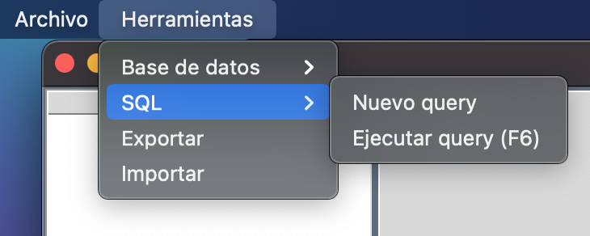

# Manual de Usuario OLC2

Creado por: CARLOS JAVIER MARTÍNEZ POLANCO
Fecha de creación: 21 de diciembre de 2023 23:11

# Descripción de la Interfaz Gráfica

El IDE de gestión de DBMS ha sido diseñado para simplificar la administración de bases de datos, ofreciendo una interfaz intuitiva y funcionalidades que permiten una manipulación eficiente de componentes.

### **Menú Principal**

El menú principal se presenta en forma de árbol, mostrando cada base de datos creada y sus respectivos submenús de tablas, funciones y procedimientos.

### Captura de Pantalla: Menú Principal

*(Captura del menú desplegado, mostrando las bases de datos y sus componentes.)*

### **Opciones de Archivo**

El menú "Archivo" ofrece diversas opciones para el manejo de archivos y sesiones.

### Capturas de Pantalla: Opciones de Archivo

*(Capturas de las opciones: Nuevo, Abrir, Guardar, Guardar como, Cerrar, Salir en el menú de Archivo.)*

### **Herramientas**

El menú "Herramientas" proporciona funcionalidades clave para la administración de bases de datos.

### Base de Datos

Este submenú permite la gestión de bases de datos: creación, eliminación, creación de DUMP, selección de bases de datos, ejecución de SQL, entre otras funcionalidades.

### Capturas de Pantalla: Herramientas - Base de Datos

*(Capturas de las opciones: Crear una nueva base de datos, Eliminar base de datos, Crear DUMP, Seleccionar Base de datos, Exportar, Importar.)*

### Manejo de base de datos por medio de query

Este submenu nos permite la administración de bases de datos por medio de querys que se ejecutaran en la aplicación. 

### Capturas de Pantalla: Herramientas - SQL

*(Capturas de las opciones: SQL, Nuevo Query, Ejecutar Query.)*

### Editor de Texto

El editor de texto está diseñado para ingresar código XSQL, con resaltado de sintaxis y capacidad de guardar querys para su uso futuro.

### Captura de Pantalla: Editor de Texto

*(Captura del editor de texto con código XSQL y funcionalidades destacadas como resaltado de sintaxis y opción para guardar querys.)*

### Salida de Datos

El área de salida muestra los datos recuperados en forma de tabla, o el encabezado en caso de ausencia de datos. Además, informa sobre errores léxicos, sintácticos o semánticos, indicando la posición exacta y la palabra responsable del error.

### Captura de Pantalla: Salida de Datos

*(Captura del área de salida, mostrando datos recuperados o encabezados de tabla, y ejemplo de cómo se informan los errores con precisión.)*

### Navegación de Bases de Datos

El sistema permite navegar en una estructura de base de datos creada a partir de un script o de las funciones de la sección de herramientas. La estructura creada cuenta con un directorio principal, el cual contiene subdirectorios asociados a todos los componentes de la base de datos (tablas, procedimientos y funciones). Estos directorios y subdirectorios contienen archivos XML con las estructuras de estos componentes y también almacenan los registros creados.

### Captura de pantalla: Ejemplo de la estructura de una base de datos

(captura de pantalla de la salida de la ejecución de un script, también se observa como se genera la estructura de base de datos luego de dicha ejecución)

### Reportes generados

En la sección de reportes podemos encontrar las siguientes opciones: 
Reporte de AST, Reporte de Tabla de Símbolos y Reporte Gramatical.

### Reporte AST

Se genera una imagen con la herramienta Graphviz en la cual podemos observar el arbol de sintaxis generado por la entrada al ser analizada con la gramática utilizada con PLY en el generador de lenguaje.

_13.14.35.png)

### Captura de pantalla: AST

(Captura de pantalla, ejemplo del AST generado)

_13.16.49.png)

_13.17.53.png)

### Reporte Tabla de Símbolos

Este reporte muestra una tabla con los símbolos leídos por el analizador, dicho reportes unicamente tendrá información al declarar una variable y setearle un valor. 

### Captura de pantalla: Reporte de Tabla de Símbolos

(Captura de pantalla ejemplo de la tabla de símbolos)

_13.29.47.png)

_13.32.23.png)

_13.33.48.png)

### Reporte Gramatical

Este reporte nos muestra la composición de la gramática utilizada por PLY para realizar el generador de lenguaje. Nos abre un enlace a una pagina HTML en la cual podemos encontrar dicha gramática.

### Captura de pantalla: Reporte Gramatical

(Captura de pantalla que muestra una página en HTML con la gramática utilizada)

_13.24.08.png)