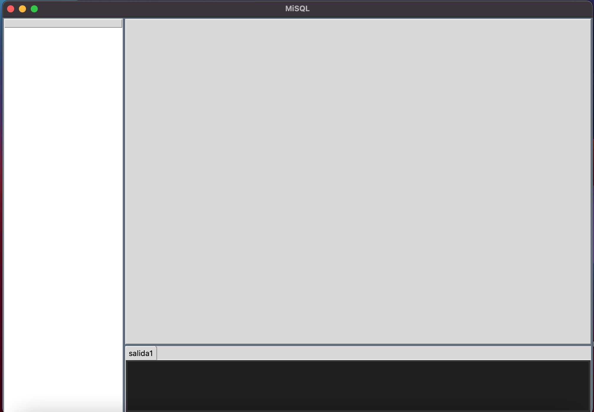
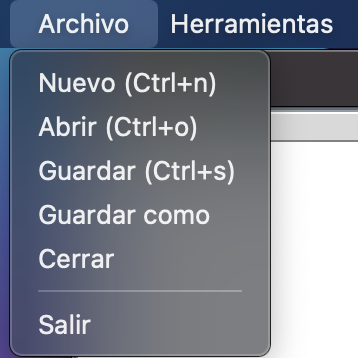
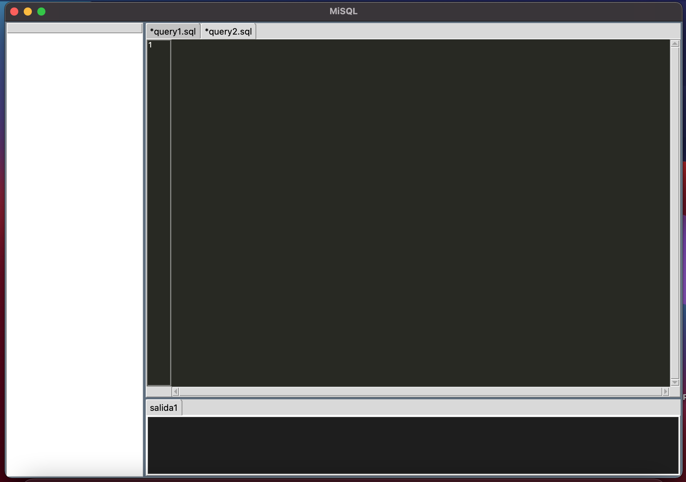
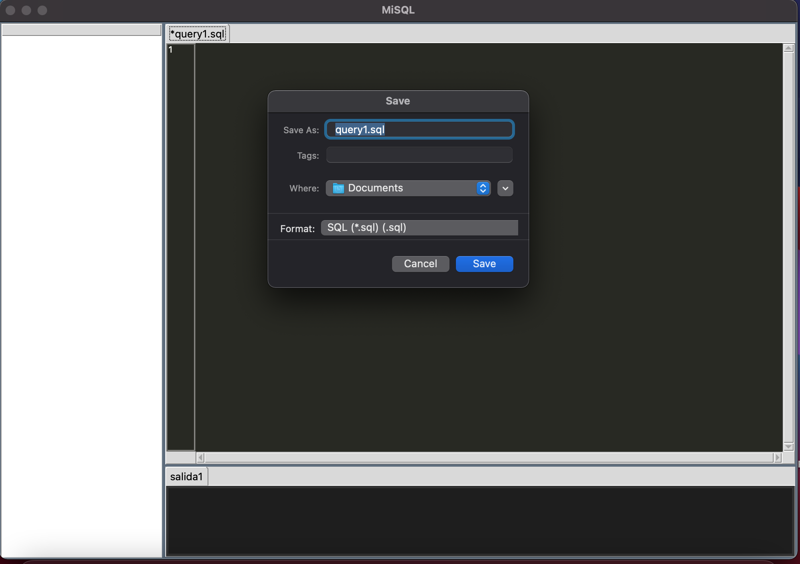
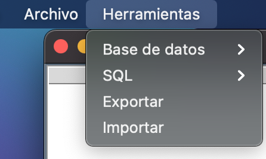
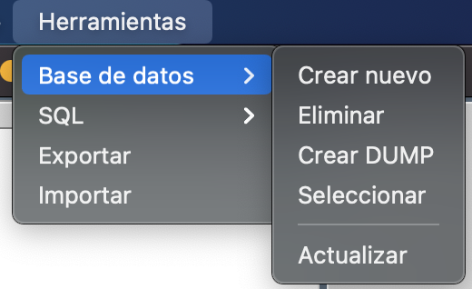
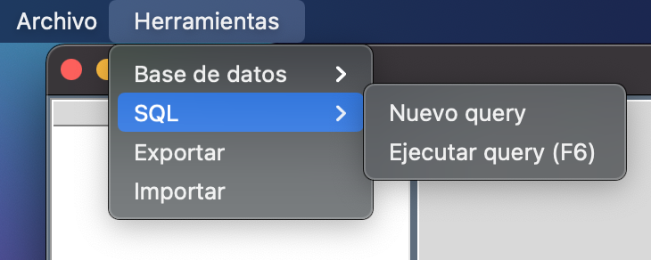
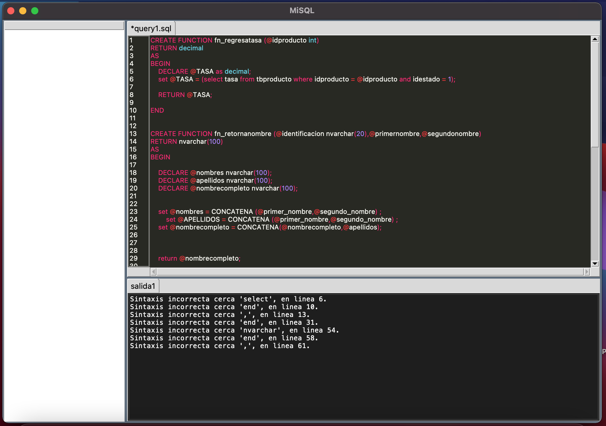
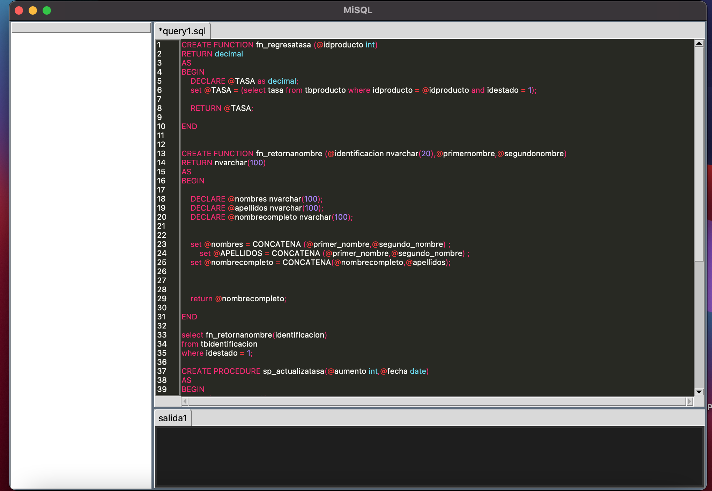
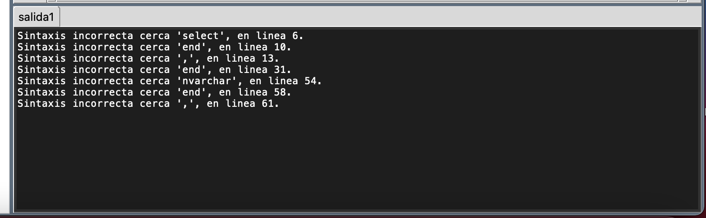

# Manual de Usuario OLC2

Creado por: CARLOS JAVIER MARTÍNEZ POLANCO
Fecha de creación: 21 de diciembre de 2023 23:11

# Descripción de la Interfaz Gráfica

El IDE de gestión de DBMS ha sido diseñado para simplificar la administración de bases de datos, ofreciendo una interfaz intuitiva y funcionalidades que permiten una manipulación eficiente de componentes.

### **Menú Principal**

El menú principal se presenta en forma de árbol, mostrando cada base de datos creada y sus respectivos submenús de tablas, funciones y procedimientos.

### Captura de Pantalla: Menú Principal

*(Captura del menú desplegado, mostrando las bases de datos y sus componentes.)*

### **Opciones de Archivo**

El menú "Archivo" ofrece diversas opciones para el manejo de archivos y sesiones.

### Capturas de Pantalla: Opciones de Archivo

*(Capturas de las opciones: Nuevo, Abrir, Guardar, Guardar como, Cerrar, Salir en el menú de Archivo.)*

### **Herramientas**

El menú "Herramientas" proporciona funcionalidades clave para la administración de bases de datos.

### Base de Datos

Este submenú permite la gestión de bases de datos: creación, eliminación, creación de DUMP, selección de bases de datos, ejecución de SQL, entre otras funcionalidades.

### Capturas de Pantalla: Herramientas - Base de Datos

*(Capturas de las opciones: Crear una nueva base de datos, Eliminar base de datos, Crear DUMP, Seleccionar Base de datos, Exportar, Importar.)*

### Manejo de base de datos por medio de query

Este submenu nos permite la administración de bases de datos por medio de querys que se ejecutaran en la aplicación. 

### Capturas de Pantalla: Herramientas - SQL

*(Capturas de las opciones: SQL, Nuevo Query, Ejecutar Query.)*

### Editor de Texto

El editor de texto está diseñado para ingresar código XSQL, con resaltado de sintaxis y capacidad de guardar querys para su uso futuro.

### Captura de Pantalla: Editor de Texto

*(Captura del editor de texto con código XSQL y funcionalidades destacadas como resaltado de sintaxis y opción para guardar querys.)*

### Salida de Datos

El área de salida muestra los datos recuperados en forma de tabla, o el encabezado en caso de ausencia de datos. Además, informa sobre errores léxicos, sintácticos o semánticos, indicando la posición exacta y la palabra responsable del error.

### Captura de Pantalla: Salida de Datos

*(Captura del área de salida, mostrando datos recuperados o encabezados de tabla, y ejemplo de cómo se informan los errores con precisión.)*

